Texty - Advanced native Android Image To Text Scanner

<b>Overview</b>

Texty is a powerful app that lets you retrieve texts of so many languages from your images using powerful machine learning models. You can easily switch from different languages models from within the app. The app also lets detect in which language your text is written. You can store your scanned remotely in a server within your account so only you can find them anywhere.
 

<b>Features</b>
<ul>
<li>Kotlin Language: This project is developed in Kotlin language with Google latest guideline and material design.</li>
<li>Powerful machine learning models.</li> 
<li>Detect and read almost every language.</li> 
<li>Register, sign in and retrieve password functionalities.</li> 
<li>Switch between languages models.</li> 
<li>Store scanned texts remotely.</li>
<li>Light/Dark themes</li>  
<li>Supports Android 13.</li>

</ul>

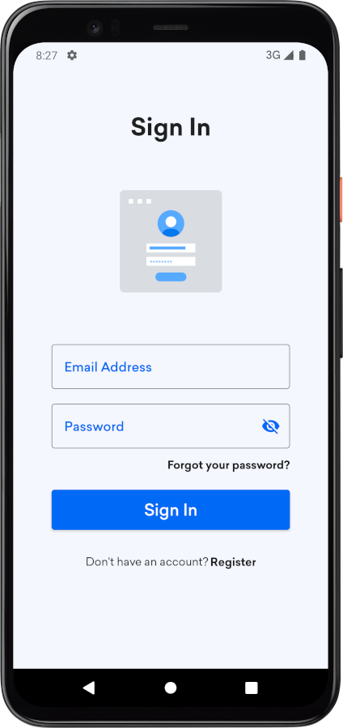

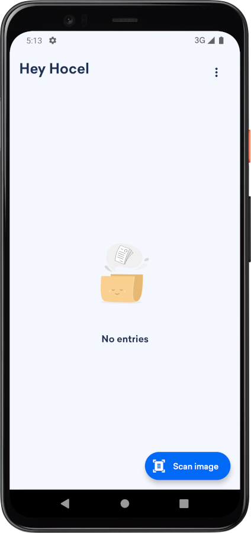
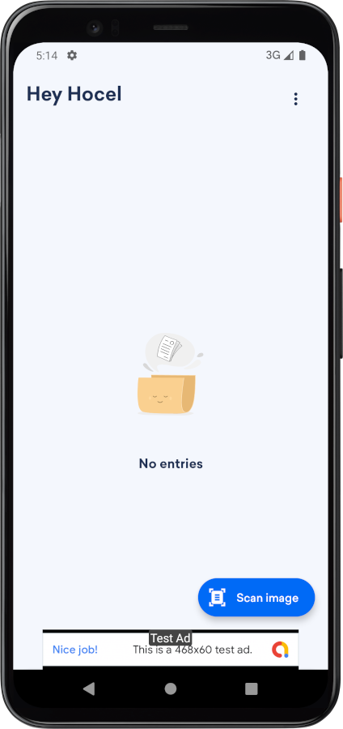
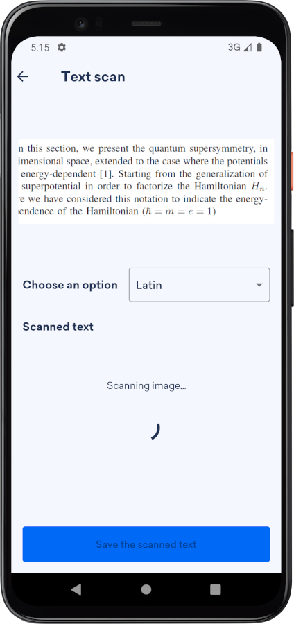
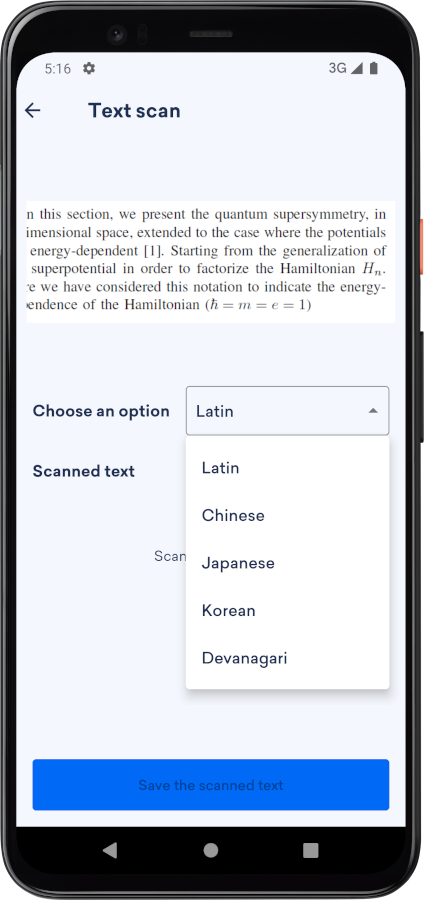
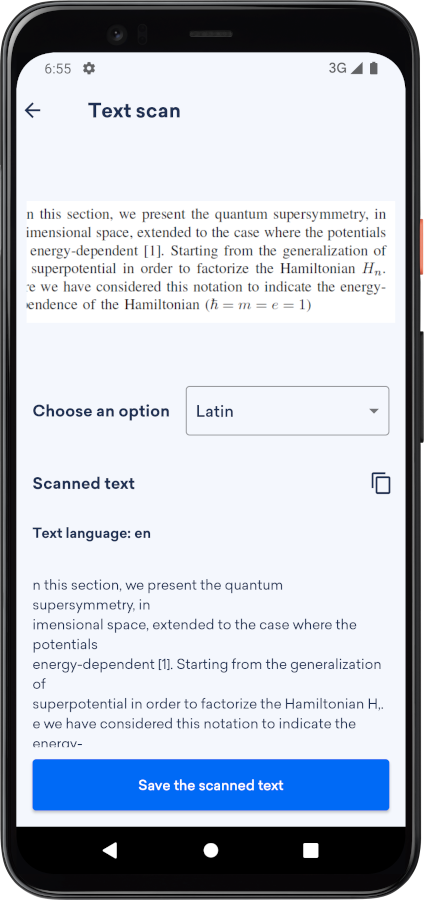
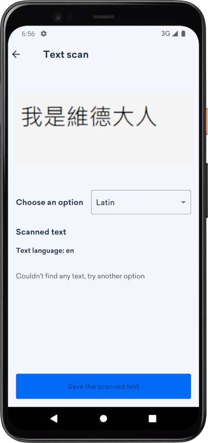
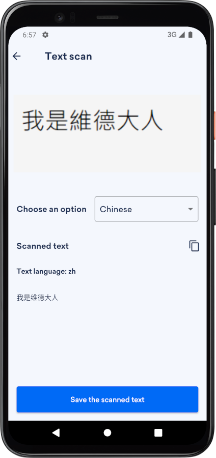
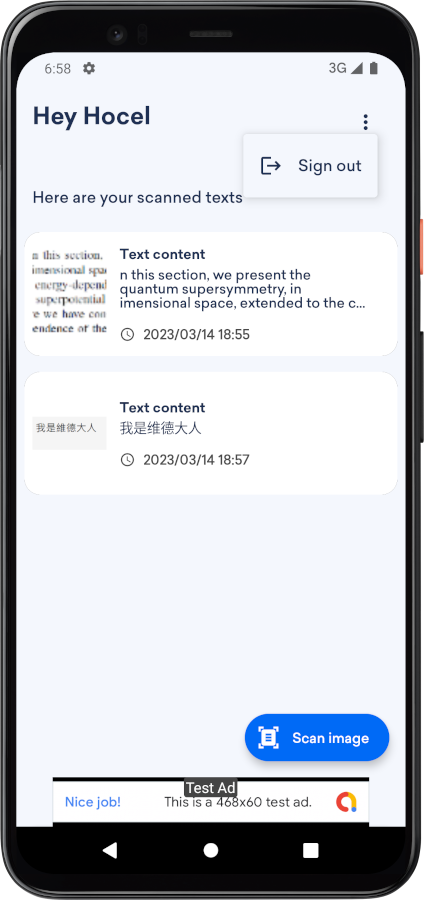
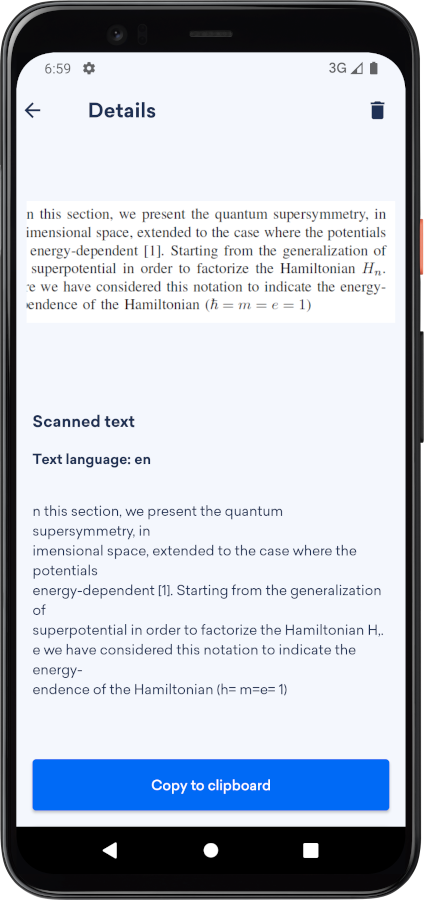
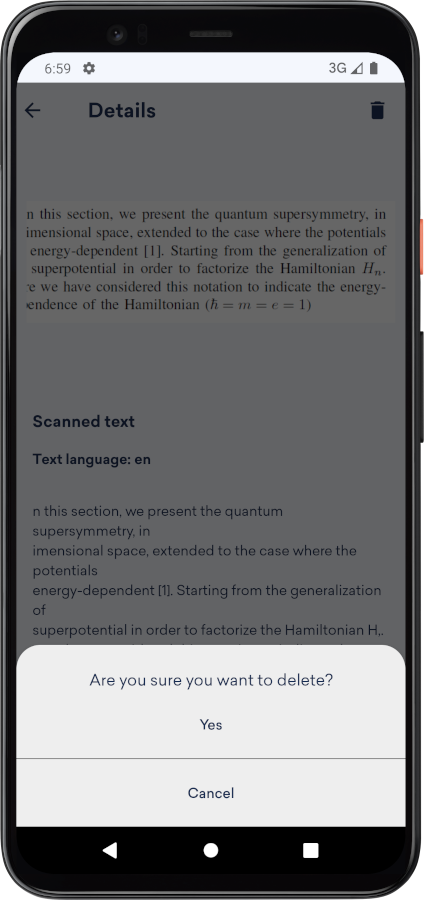

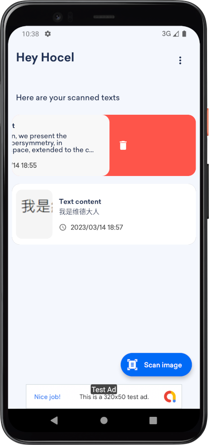
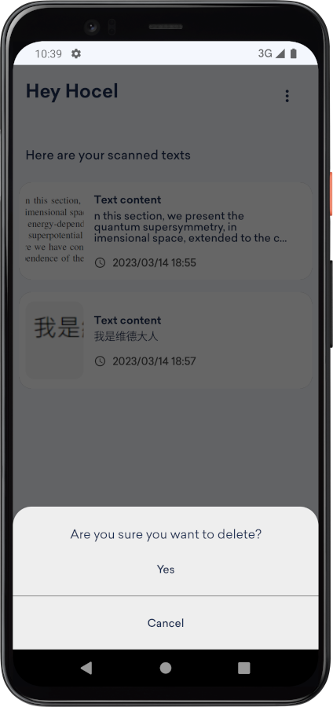
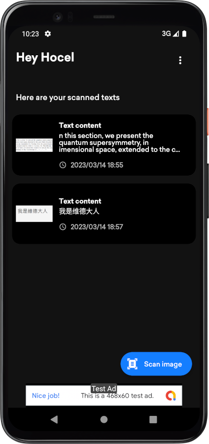
